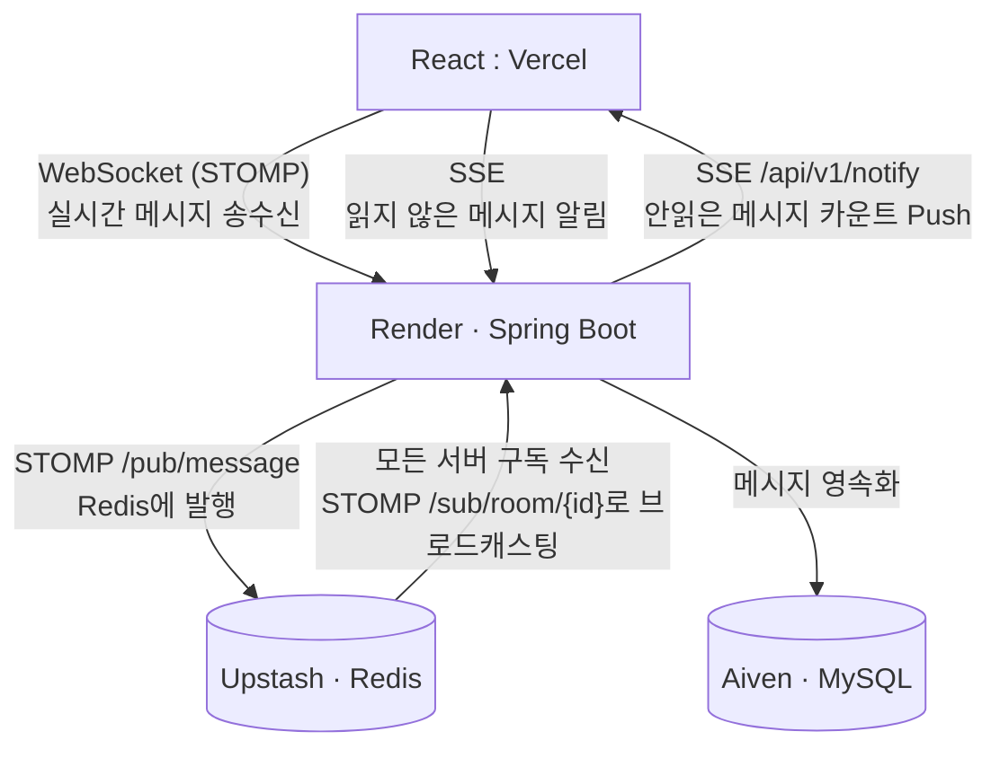

# 💬 Chat Notify

> 실시간 채팅 + SSE 알림 서버  
> **WebSocket · Redis Pub/Sub · JWT 인증 · 분산 환경 브로드캐스팅**

---

## 📌 프로젝트 개요

[puzzle-leaderboard](https://github.com/funhappyit/puzzle-leaderboard)에 이어  
**실시간 양방향 통신, 분산 메시지 브로드캐스팅, SSE 알림**을 다루는 프로젝트.

단일 서버에서만 동작하는 WebSocket의 한계를 **Redis Pub/Sub**으로 해결하여  
다중 서버 환경에서도 모든 클라이언트에 메시지가 정상적으로 전달되도록 구현한다.

---

## 🛠 기술 스택

| 분류 | 기술 |
|------|------|
| Language | Java 21 |
| Framework | Spring Boot 3.x |
| 실시간 통신 | Spring WebSocket + STOMP |
| 알림 | SSE (Server-Sent Events) |
| 인증 | JWT (Access + Refresh Token) · Spring Security |
| DB | MySQL (Aiven) |
| Cache / 분산 | Redis Pub/Sub (Upstash) |
| 마이그레이션 | Flyway |
| CI/CD | GitHub Actions |
| Frontend | React 18 + TypeScript + Vite → Vercel |
| Infra | Render (Spring Boot) · Aiven (MySQL) · Upstash (Redis) |

---

## 🏗 아키텍처



**Redis Pub/Sub이 필요한 이유**
```
[서버 A] ──── WebSocket ──── [클라이언트 1]
[서버 B] ──── WebSocket ──── [클라이언트 2]

서버 A로 메시지 전송 시 → 서버 B의 클라이언트 2는 수신 불가 ❌
Redis Pub/Sub 적용 시  → 서버 A 발행 → Redis → 서버 B 수신 → 클라이언트 2 전달 ✅
```

---

## 🗄 ERD

```
users
├── id (PK)
├── username (UQ)
├── email (UQ)
├── password_hash
└── created_at

chat_rooms
├── id (PK)
├── name
├── created_by (FK → users)
└── created_at

room_members
├── id (PK)
├── room_id (FK → chat_rooms)
├── user_id (FK → users)
└── joined_at

messages
├── id (PK)
├── room_id (FK → chat_rooms)
├── sender_id (FK → users)
├── content
├── is_read
└── sent_at
```

---

## 📡 API

| Method | Path | 설명 |
|--------|------|------|
| `POST` | `/api/v1/auth/signup` | 회원가입 |
| `POST` | `/api/v1/auth/login` | 로그인 (JWT 발급) |
| `POST` | `/api/v1/auth/refresh` | Access Token 재발급 |
| `GET` | `/api/v1/rooms` | 채팅방 목록 조회 |
| `POST` | `/api/v1/rooms` | 채팅방 생성 |
| `POST` | `/api/v1/rooms/{id}/join` | 채팅방 입장 |
| `GET` | `/api/v1/rooms/{id}/messages` | 메시지 내역 조회 |
| `STOMP` | `/pub/message` | 메시지 발행 |
| `STOMP` | `/sub/room/{id}` | 채팅방 구독 |
| `SSE` | `/api/v1/notify/subscribe` | 알림 구독 |

---

## 🚀 로컬 실행

### 사전 요구사항
- JDK 21+
- Docker Desktop
- Node.js 18+

### 1. 인프라 실행
```bash
docker compose up -d
# MySQL: localhost:3307
# Redis: localhost:6379
```

### 2. 백엔드 실행
```bash
./gradlew bootRun --args='--spring.profiles.active=local'
# http://localhost:8080
```

### 3. 프론트엔드 실행
```bash
cd frontend
npm install
npm run dev
# http://localhost:5173
```

---

## 📅 개발 로드맵

- [x] JWT 인증 + 프로젝트 기반 구축 ([#1](https://github.com/amiesoft-hyk/chat-notify/issues/1))
- [x] WebSocket + STOMP 실시간 채팅 ([#2](https://github.com/amiesoft-hyk/chat-notify/issues/2))
- [x] SSE 알림 + Redis Pub/Sub 분산 브로드캐스팅 ([#3](https://github.com/amiesoft-hyk/chat-notify/issues/3))
- [ ] 배포 및 마무리 ([#4](https://github.com/amiesoft-hyk/chat-notify/issues/4))

---

## 🔗 관련 링크

- [GitHub Issues](https://github.com/amiesoft-hyk/chat-notify/issues)
- [Frontend](https://chat-notify.vercel.app)
- [Backend API](https://chat-notify.onrender.com)
